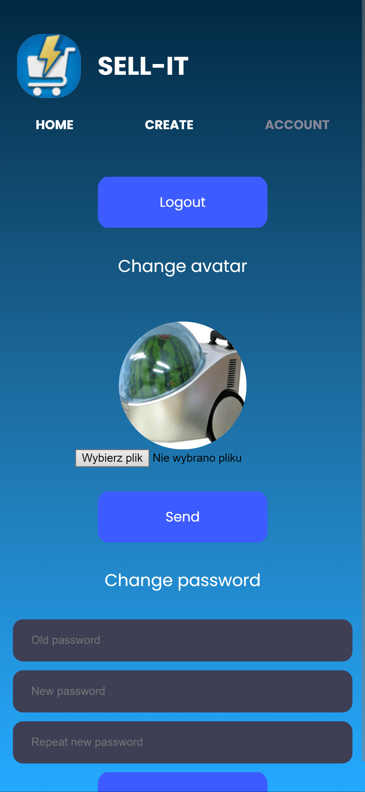

# SELL-IT
The SELL-IT application is a wizard for creating offers on auction portals. Its purpose is to encourage users to sell unnecessary items on the Internet.
Thanks to many offer templates and simple operation, the user will quickly create detailed descriptions of items.

# Table of Contents

1. [Features](#features)
2. [Technology Stack](#technology-stack)
3. [Installation](#installation)
4. [Usage](#usage)
5. [Author](#author)

## Features

- **Intuitive User Interface** Experience ease of use with a user-friendly interface that simplifies the process of creating and managing your offers.
- **Template Saving Capability** Save time and effort by storing your customized templates, allowing you to quickly replicate and apply them to new offers.
- **Ready-Made Templates** Access a library of pre-designed templates, making it convenient to create professional and engaging offers without starting from scratch.

## Technology Stack

Project is built using a variety of technologies and tools to ensure efficiency, performance, and scalability. Below is a list of the key components:

1. **Front-End:**
   - HTML5: Markup language essential for structuring content on the web.
   - CSS3: Used for styling and layout to enhance the visual presentation of HTML elements.
   - JavaScript: Versatile scripting language that adds dynamic behavior and interactivity to web pages.

2. **Back-End:**
   - PHP8: Server-side scripting language widely used for building dynamic web applications.
   - PostgreSQL: Powerful open-source relational database employed for data storage and retrieval in the back-end.

3. **Server:**
   - Nginx: High-performance web server known for its efficiency in handling concurrent connections and serving static content.

4. **Containerization:**
   - Docker: Facilitates containerization, enabling developers to package applications and their dependencies for consistent deployment across different environments.
     
5. **Version Control:**
   - Git: Distributed version control system crucial for tracking changes in code, collaborating with others, and managing software development projects.

## Installation

The project has been Dockerized to facilitate easy setup and deployment. Follow these instructions to initiate and run the project:

1. **Clone the Repository**
2. **Navigate to the Project Directory**
3. **Docker Setup:**
Make sure Docker and Docker Compose are installed on your system. Within the project directory, you'll discover Docker configuration files in the `docker/php`, `docker/db` and `docker/nginx` directories, accompanied by a respective `Dockerfile`.
4. **Build Docker Images:**
Execute the following command: `docker-compose build`
5. **Start Docker Containers:**
Start the containers using: `docker-compose up`
6. **Access the Application:**
Once the containers are operational, access the application through your browser.

## Usage

### Login Page
Desktop | Mobile
:-------------------------:|:-------------------------:
 | 

### Sign-up Page
Desktop | Mobile
:-------------------------:|:-------------------------:
 | 

### Home Page
Desktop | Mobile
:-------------------------:|:-------------------------:
 | 

### Offer Page
Desktop | Mobile
:-------------------------:|:-------------------------:
 | 

### Create Page
Desktop | Mobile
:-------------------------:|:-------------------------:
 | 

### Account Page
Desktop | Mobile
:-------------------------:|:-------------------------:
 | 

## Author
Jacek Kamiński
